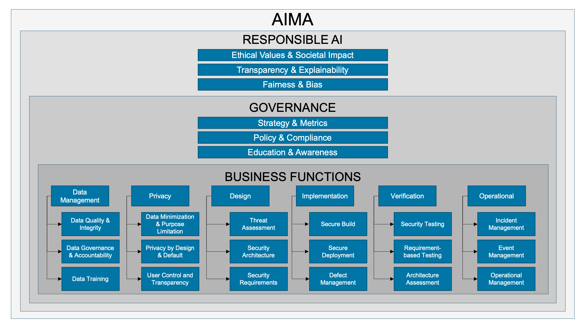

# Introduction

The OWASP AI Maturity Assessment (AIMA) provides organizations with a structured approach for evaluating and improving the security, trustworthiness, and compliance of AI systems. Rooted in the principles of OWASP SAMM but tailored to the distinct challenges of AI, AIMA defines measurable pathways that guide responsible AI adoption across industries and organizational contexts.

AI systems introduce fundamentally new risks—ethical, operational, and technical—that require governance mechanisms beyond those used for traditional software. AIMA responds to this need with a risk-based model that integrates security, transparency, privacy, and lifecycle management into each phase of AI development and deployment.

## The Need for AI Maturity Assessment Model

As organizations across the world accelerate the adoption of artificial intelligence (AI) technologies, the need for a structured AI Maturity Model  has become increasingly important. AI systems present a unique set of challenges related to security, privacy, fairness, transparency, and accountability, which are not fully addressed by traditional IT governance models. A globally applicable AI maturity model enables organizations to evaluate their current capabilities, identify risk areas, and adopt best practices across the AI lifecycle. By integrating privacy-by-design and security-by-design principles from the outset—covering data collection, model training, deployment, and ongoing monitoring—organizations can foster trust, resilience, and ethical outcomes in AI applications.

Adopting an AI maturity framework is essential not only for reducing operational and regulatory risks, but also for building responsible, secure, and privacy-preserving AI systems that meet international expectations. These frameworks support consistency, interoperability, and compliance with evolving global standards, such as the EU AI Act, OECD AI Principles, and emerging guidance from bodies like ISO and NIST. In an interconnected digital economy, maturity frameworks empower both public and private sector organizations to innovate confidently, safeguard individual rights, and reinforce  trust in AI technologies that increasingly influence critical decisions across health, finance, education, and public services.

## Why Existing Maturity Models Fall Short

Traditional maturity models like CMMI or OWASP SAMM provide proven methods for securing conventional software development, but they were not built with AI’s unique properties in mind. AI-specific challenges include:

- **Non-deterministic behavior**: Model outputs change with data and context.
- **Opaque decision logic**: AI models often lack interpretability.
- **Data-centric vulnerabilities**: Adversarial attacks and data poisoning exploit training pipelines.
- **Dynamic risk surfaces**: AI systems evolve over time, requiring ongoing assurance.

Existing frameworks rarely address these issues comprehensively. Organizations attempting to apply them to AI are often left with policy-level principles and no actionable guidance.

## The OWASP Ecosystem and AI-Specific Resources

AIMA builds on OWASP’s broader commitment to AI security and privacy. Several sister projects provide complementary guidance:

- [OWASP Top 10 for Large Language Model Applications](https://owasp.org/www-project-top-10-for-large-language-model-applications/): A curated list of the most critical security vulnerabilities in LLM-based systems.
- [OWASP AI Security and Privacy Guide](https://owasp.org/www-project-ai-security-and-privacy-guide/): Practical advice on building, testing, and procuring secure and privacy-preserving AI systems.
- [OWASP AI Exchange](https://owaspai.org): A comprehensive, community-driven repository of AI security and governance best practices.
- [OWASP Machine Learning Security Top 10](https://owasp.org/www-project-machine-learning-security-top-10/): A threat taxonomy for ML systems, including adversarial and infrastructure-level attacks.

Together, these resources form the backbone of AIMA’s threat model, scope, and community approach.

## What AIMA Adds

AIMA bridges the gap between principles and practice. It translates abstract goals such as fairness, robustness, and transparency into measurable activities and outcomes. It supports:

- **Contextual assessments**: Tailored to different levels of AI adoption and maturity.
- **Incremental improvement**: Maturity levels define a progression path without requiring immediate full compliance.
- **Cross-functional alignment**: Designed for technical teams, legal advisors, risk managers, and executive leadership.

Unlike some proprietary or closed maturity frameworks, AIMA is open-source and community-driven. It invites adaptation and evolution through real-world usage, feedback, and iteration.

## Overview of the AIMA Model

AIMA defines eight assessment domains that span the entire AI system lifecycle:

- **Responsible AI Principles**: Fairness, transparency, and societal impact.
- **Governance**: Strategy, policy, and education.
- **Data Management**: Quality, accountability, and training data practices.
- **Privacy**: Data minimization, privacy by design, and user control.
- **Design**: Threat modeling, security architecture, and requirements.
- **Implementation**: Secure build, deployment, and defect management.
- **Verification**: Testing and architecture validation.
- **Operations**: Monitoring, incident response, and system lifecycle management.

Each domain includes maturity criteria grouped into two complementary streams: _Create & Promote_ (stream A) and _Measure & Improve_ (stream B). Organizations can evaluate their posture, identify gaps, and prioritize improvements in a structured way.

This document provides detailed descriptions, worksheets, and guidance to support practical adoption of AIMA across sectors.
