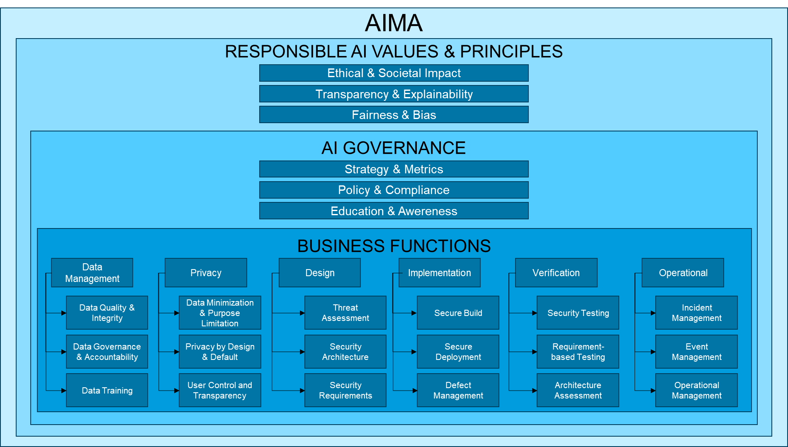

## The AIMA Model

The AI Maturity Assessment (AIMA) model provides a structured framework for evaluating, managing, and continuously improving AI systems throughout their lifecycle. Building upon the OWASP Software Assurance Maturity Model (SAMM), the AIMA framework addresses the unique security, ethical, privacy, and governance challenges posed by AI technologies. It emphasizes an integrated approach covering Governance, Responsible AI Principles, Data Management, Privacy, Design, Implementation, Verification, and Operations.

AIMA translates high-level AI principles into actionable guidance, equipping organizations to navigate regulatory requirements and align AI development with societal expectations. With clear maturity benchmarks and structured guidance, the model is designed to be applicable to organizations of all sizes and maturity levels, facilitating responsible innovation and secure deployment of AI systems.

### Governance

- **Strategy and Metrics:** Defining and tracking AI-specific strategic objectives and measurable outcomes aligned with organizational goals, risk appetite, and ethical frameworks.
- **Policy and Compliance:** Establishing and enforcing AI-focused policies, standards, and regulatory compliance frameworks to ensure ethical, legal, and secure AI usage.
- **Education and Awareness:** Providing tailored training, guidance, and resources to stakeholders involved in AI systems, promoting responsible and secure practices.

### Responsible AI Principles

- **Fairness and Bias:** Identifying, mitigating, and monitoring biases within AI systems to ensure equitable outcomes.
- **Transparency and Explainability:** Enhancing AI system transparency and interpretability to build trust and facilitate accountability.
- **Ethical and Societal Impact:** Assessing and addressing the broader ethical and societal implications of AI deployment and usage.

### Data Management

- **Data Quality and Integrity:** Ensuring high-quality, reliable, and secure data to support accurate and robust AI models.
- **Data Governance and Accountability:** Implementing clear responsibilities and processes for data management, security, and ethical usage.
- **Data Training:** Managing and monitoring AI training datasets to ensure accuracy, security, and compliance with established standards.

### Privacy

- **Data Minimization and Purpose Limitation:** Collecting and processing data strictly aligned with clearly defined purposes, adhering to privacy best practices and regulatory guidelines.
- **Privacy by Design and Default:** Integrating privacy measures proactively within AI system design and operation.
- **User Control and Transparency:** Empowering users through clear communication, transparency, and meaningful control over their data.

### Design

- **Threat Assessment:** Identifying AI-specific security threats, including adversarial machine learning attacks and data manipulation.
- **Security Architecture:** Designing robust AI systems that proactively address security risks through layered defenses and secure design principles.
- **Security Requirements:** Clearly defining security expectations and criteria tailored explicitly to AI system functionalities and risks.

### Implementation

- **Secure Build:** Embedding secure development practices within AI workflows, covering data preparation, model training, and deployment.
- **Secure Deployment:** Ensuring AI systems are securely deployed and maintained, protecting models and data in operational environments.
- **Defect Management:** Establishing systematic processes for identifying, tracking, and remediating vulnerabilities and defects in AI models and infrastructure.

### Verification

- **Security Testing:** Performing specialized testing to validate the security and robustness of AI systems against known and emerging threats.
- **Requirement-based Testing:** Ensuring AI systems fulfill defined security, functionality, and compliance requirements through structured and repeatable testing practices.
- **Architecture Assessment:** Regularly assessing AI architectures to verify alignment with security standards, best practices, and ethical guidelines.

### Operations

- **Incident Management:** Responding efficiently and effectively to security incidents involving AI systems, including model compromise or data breaches.
- **Event Management:** Continuously monitoring AI system events and performance to detect anomalies or deviations from intended behavior.
- **Operational Management:** Managing ongoing AI system operations to ensure secure, reliable, and compliant performance throughout the AI lifecycle.

